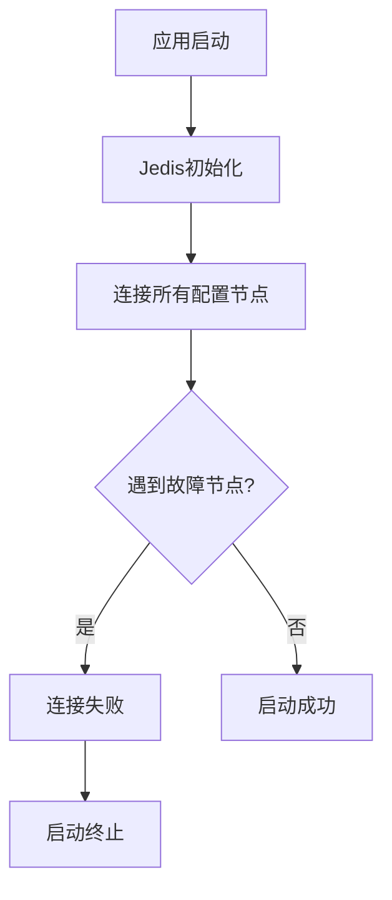
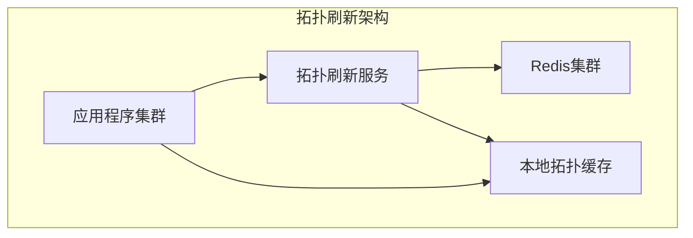

# Redis生产事件总结报告

## 事件概述

### 事件时间

- **触发时间**：2025年4月
- **恢复时间**：2025年4月(当天)
- **持续时间**：约1小时

### 影响范围

- **系统影响**：Redis集群不可用
- **业务影响**：依赖Redis的相关金融服务功能受影响
- **应用影响**：全部应用重启时无法正常启动

## 事件背景

### 历史操作（2022年）

2022年进行的Redis集群切换演练中，由于操作配置问题，导致两个主节点（master）被部署在同一数据中心。这一配置隐患一直存在但未暴露，直到本次事件触发。

### 事件触发条件

2025年4月，该数据中心发生故障，导致位于同一中心的两个master节点同时不可用。根据Redis集群的故障转移机制：

- 一半的slot（哈希槽）正常完成了自动转移
- 另一半slot因两个master在同一位置，无法满足故障转移条件，导致迁移失败

## 影响分析

### 直接表现

1. **集群状态异常**：部分数据分片不可用
2. **应用启动失败**：所有应用程序重启时均无法正常启动
3. **服务不可用**：依赖Redis的业务功能受限或不可用

### 配置分析

**关键配置**：`cluster-require-full-coverage=yes`

- **配置含义**：要求集群所有slot都必须被覆盖时，集群才对外提供写服务
- **金融系统要求**：银行金融系统因强一致性要求，必须设置此参数为yes
- **问题表现**：当部分slot不可用时，整个集群拒绝写操作，导致服务不可用

## 根本原因分析

### 第一层原因：架构配置缺陷

1. **违反部署原则**：两个master节点部署在同一数据中心，违反高可用部署原则
2. **历史遗留隐患**：2022年演练后的配置未恢复，隐患长期存在

### 第二层原因：客户端框架限制

**自研框架中Jedis 2.9版本存在以下问题：**

| 问题项       | 具体表现               | 影响程度 |
| :----------- | :--------------------- | :------- |
| 拓扑自动刷新 | 不支持自动刷新集群拓扑 | 高       |
| 启动连接策略 | 启动时连接所有配置节点 | 严重     |
| 故障容忍度   | 遇到故障节点直接失败   | 严重     |

**启动流程缺陷**：



  初始化槽位缓存时 JedisClusterConnectionHandler中源码如下：

```java
private void initializeSlotsCache(Set<HostAndPort> startNodes, GenericObjectPoolConfig poolConfig, String password) {
    for (HostAndPort hostAndPort : startNodes) {
      Jedis jedis = new Jedis(hostAndPort.getHost(), hostAndPort.getPort());
      if (password != null) {
        jedis.auth(password);
      }
      try {
        cache.discoverClusterNodesAndSlots(jedis);
        break;
      } catch (JedisConnectionException e) {
        // try next nodes
      } finally {
        if (jedis != null) {
          jedis.close();
        }
      }
    }
  }
```

每一个节点都会在auth时进行contect连接，也就导致了启动时连接故障节点抛出JedisConnectionException最终启动失败。


### 第三层原因：集群配置与业务要求的矛盾

- **业务要求**：强一致性 → `cluster-require-full-coverage=yes`
- **可用性要求**：部分故障时仍需服务 → 与上述配置矛盾
- **缺乏应用中间方案**：部分功能未设计redis集群故障时的降级策略

## 解决方案与修复过程

### 第一阶段：紧急恢复（应用启动）

**方案**：修改应用启动健康检查机制

1. **健康检查过滤**：启动时跳过配置中的故障节点
2. **实现方式**：
   - 在Jedis初始化前增加节点健康检查
   - 仅连接健康的节点完成初始化
   - 记录故障节点信息用于后续恢复

**修复代码示例**：

```java
import org.slf4j.Logger;
import org.slf4j.LoggerFactory;
import org.springframework.stereotype.Component;

import java.util.HashSet;
import java.util.Set;
import java.util.concurrent.CopyOnWriteArraySet;

/**
 * @author huqinuo
 * @version 1.0
 * @description Redis节点上下文管理器
 * @data 2025/12/1 9:25
 */
@Component
public class RedisNodeContext {

    private final Logger log = LoggerFactory.getLogger(RedisNodeContext.class);

    private final Set<String> unhealthyNodes = new CopyOnWriteArraySet<>();

    private final Set<String> allNodes = new CopyOnWriteArraySet<>();

    /**
     * 初始化方法，从静态数据加载
     */
    public void initializeFromStaticData() {
        if (RedisHealthChecker.isHealthCheckCompleted()) {
            this.allNodes.clear();
            this.allNodes.addAll(RedisHealthChecker.getAllNodes());

            this.unhealthyNodes.clear();
            this.unhealthyNodes.addAll(RedisHealthChecker.getUnhealthyNodes());

            log.info("RedisNodeContext initialized from static data: {}/{} nodes healthy",
                    getHealthyNodeCount(), allNodes.size());
        }
    }

    /**
     * 添加不健康节点
     */
    public void addUnhealthyNode(String node) {
        unhealthyNodes.add(node);
    }

    /**
     * 移除不健康节点（节点恢复时调用）
     */
    public void removeUnhealthyNode(String node) {
        unhealthyNodes.remove(node);
    }

    /**
     * 获取所有不健康节点
     */
    public Set<String> getUnhealthyNodes() {
        return new HashSet<>(unhealthyNodes);
    }

    /**
     * 检查节点是否不健康
     */
    public boolean isNodeUnhealthy(String node) {
        return unhealthyNodes.contains(node);
    }

    /**
     * 设置所有节点
     */
    public void setAllNodes(Set<String> nodes) {
        allNodes.clear();
        allNodes.addAll(nodes);
    }

    /**
     * 获取所有节点
     */
    public Set<String> getAllNodes() {
        return new HashSet<>(allNodes);
    }

    /**
     * 添加单个节点
     */
    public void addNode(String node) {
        allNodes.add(node);
    }

    /**
     * 获取健康节点数量
     */
    public int getHealthyNodeCount() {
        return allNodes.size() - unhealthyNodes.size();
    }

    /**
     * 获取不健康节点数量
     */
    public int getUnhealthyNodeCount() {
        return unhealthyNodes.size();
    }
}
```

```java
package open.ref.redis;

import 自研包.RedisFactory;
import org.springframework.beans.factory.annotation.Autowired;
import org.springframework.context.annotation.Bean;
import org.springframework.context.annotation.Configuration;
import org.springframework.context.annotation.DependsOn;
import org.springframework.scheduling.annotation.EnableScheduling;

/**
 * @author huqinuo
 * @version 1.0
 * @description Redis配置类(健康检查使用)
 * @data 2025/12/1 15:31
 */
@Configuration
@EnableScheduling
public class RedisClusterConfig {

    /**
     * redis节点上下文
     */
    @Bean
    @DependsOn("redisHealthChecker")  // 确保在健康检查后执行
    public RedisNodeContext redisNodeContext() {
        RedisNodeContext context = new RedisNodeContext();
        context.initializeFromStaticData(); // 从静态数据初始化
        return context;
    }

    /**
     * 拓扑刷新器
     */
    @Bean
    @DependsOn("redisNodeContext")
    public RedisClusterTopologyRefresher redisClusterTopologyRefresher(@Autowired RedisNodeContext redisNodeContext, RedisFactory redisFactory) {
        return new RedisClusterTopologyRefresher(redisNodeContext,redisFactory);
    }
}
```

```java
package open.ref.redis;

import open.svc.dict.Const;
import org.slf4j.Logger;
import org.slf4j.LoggerFactory;
import org.springframework.beans.BeansException;
import org.springframework.beans.factory.config.BeanFactoryPostProcessor;
import org.springframework.beans.factory.config.ConfigurableListableBeanFactory;
import org.springframework.context.EnvironmentAware;
import org.springframework.core.env.ConfigurableEnvironment;
import org.springframework.core.env.Environment;
import org.springframework.core.env.MapPropertySource;
import org.springframework.stereotype.Component;
import redis.clients.jedis.Jedis;

import java.util.*;

/**
 * @author huqinuo
 * @version 1.0
 * @description Redis集群连接健康检查
 * @data 2025/12/1 10:02
 */
@Component
public class RedisHealthChecker implements BeanFactoryPostProcessor, EnvironmentAware {

    private ConfigurableEnvironment environment;

    private final Logger log = LoggerFactory.getLogger(RedisHealthChecker.class);

    private static final Set<String> unhealthyNodes = new HashSet<>();

    private static final Set<String> allNodes = new HashSet<>();

    private static final int CONNECTION_TIMEOUT = 5000;

    private static boolean healthCheckCompleted = false;

    @Override
    public void setEnvironment(Environment environment) {
        this.environment = (ConfigurableEnvironment) environment;
    }

    @Override
    public void postProcessBeanFactory(ConfigurableListableBeanFactory beanFactory) throws BeansException {
        if (healthCheckCompleted) {
            return; // 避免重复执行
        }

        if (!isRedisClusterEnabled()) {
            log.info("Redis cluster is not enabled, skip health check");
            healthCheckCompleted = true;
            return;
        }

        String oriRedisNodeUrl = getOriRedisNodeUrl();
        if (Objects.isNull(oriRedisNodeUrl)) {
            log.warn("Application does not have Redis configuration");
            healthCheckCompleted = true;
            return;
        }

        // 执行健康检查并更新配置
        performInitialHealthCheck(oriRedisNodeUrl);
        healthCheckCompleted = true;

        // 注册静态上下文到BeanFactory
        registerNodeContextBean(beanFactory);
    }

    /**
     * 注册节点上下文到BeanFactory
     */
    private void registerNodeContextBean(ConfigurableListableBeanFactory beanFactory) {
        RedisNodeContext nodeContext = new RedisNodeContext();
        nodeContext.setAllNodes(new HashSet<>(allNodes));
        for (String node : unhealthyNodes) {
            nodeContext.addUnhealthyNode(node);
        }
        beanFactory.registerSingleton("redisNodeContext", nodeContext);
        log.info("RedisNodeContext registered as singleton bean");
    }

    /**
     * 执行初始健康检查
     */
    private void performInitialHealthCheck(String oriRedisNodeUrl) {
        // 保存所有原始节点
        allNodes.clear();
        allNodes.addAll(Arrays.asList(oriRedisNodeUrl.split(Const.Symbol.Comma)));

        log.info("Starting initial Redis cluster health check for {} nodes", allNodes.size());

        // 过滤健康节点
        List<String> healthyNodes = filterHealthyClusterNodes(oriRedisNodeUrl);

        if (healthyNodes.isEmpty()) {
            log.info("No healthy Redis cluster nodes available");
            return;
        }

        String healthyRedisNodeUrl = String.join(Const.Symbol.Comma, healthyNodes);

        // 如果有不健康节点，更新配置
        if (!oriRedisNodeUrl.equals(healthyRedisNodeUrl)) {
            updateRedisConfiguration(healthyRedisNodeUrl);
            log.warn("Redis configuration updated due to unhealthy nodes. Healthy nodes: {}", healthyRedisNodeUrl);
        }

        // 记录初始健康状态
        log.info("Initial Redis cluster health status: {}/{} nodes healthy",
                (allNodes.size() - unhealthyNodes.size()), allNodes.size());
        log.info("Unhealthy nodes: {}", unhealthyNodes);
    }

    private Boolean isRedisClusterEnabled() {
        String isEnabled = environment.getProperty("自研包.cluster.enabled");
        if (isEnabled != null) {
            return Boolean.parseBoolean(isEnabled);
        }
        return Boolean.FALSE;
    }

    private String getOriRedisNodeUrl() {
        // 提取集群配置
        String clusterNodes = environment.getProperty("spring.redis.cluster.nodes");
        log.info("Redis cluster nodes configuration: {}", clusterNodes);
        if (clusterNodes != null) {
            return clusterNodes;
        }
        return null;
    }

    private String getAuthPassword() {
        // 提取认证配置
        String auth = environment.getProperty("spring.redis.password");
        if (auth != null) {
            return auth;
        }
        return null;
    }

    private List<String> filterHealthyClusterNodes(String oriRedisNodeUrl) {
        List<String> healthyNodes = new ArrayList<>();
        String[] clusterNodes = oriRedisNodeUrl.split(Const.Symbol.Comma);

        for (String node : clusterNodes) {
            if (checkRedisNode(node)) {
                healthyNodes.add(node);
                log.info("Redis cluster node {} is healthy", node);
            } else {
                // 节点不健康，记录到静态集合
                unhealthyNodes.add(node);
                log.warn("Redis cluster node {} is unhealthy, added to monitoring list", node);
            }
        }

        return healthyNodes;
    }

    private boolean checkRedisNode(String node) {
        String[] parts = node.split(":");
        String host = parts[0];
        int port = parts.length > 1 ? Integer.parseInt(parts[1]) : 6379;
        try (Jedis jedis = new Jedis(host, port, CONNECTION_TIMEOUT)) {
            String auth = getAuthPassword();
            if (!Objects.isNull(auth)) {
                jedis.auth(auth);
            }
            String result = jedis.ping();
            return "PONG".equals(result);
        } catch (Exception e) {
            log.warn("Redis node {}:{} check failed: {}", host, port, e.getMessage());
            return false;
        }
    }

    private void updateRedisConfiguration(String healthyRedisNodeUrl) {
        Map<String, Object> updatedProperties = new HashMap<>();

        // 更新集群配置
        if (healthyRedisNodeUrl != null) {
            updatedProperties.put("athena.redis.url", healthyRedisNodeUrl);
            updatedProperties.put("spring.redis.cluster.nodes", healthyRedisNodeUrl);
        }

        // 将更新后的配置添加到Environment的最高优先级
        environment.getPropertySources().addFirst(
                new MapPropertySource("redisHealthProperties", updatedProperties)
        );

        log.info("Redis configuration has been updated with healthy nodes: {}", healthyRedisNodeUrl);
    }

    /**
     * 静态方法供其他组件访问
     */
    public static Set<String> getUnhealthyNodes() {
        return new HashSet<>(unhealthyNodes);
    }

    public static Set<String> getAllNodes() {
        return new HashSet<>(allNodes);
    }

    public static boolean isHealthCheckCompleted() {
        return healthCheckCompleted;
    }
}

```

```java
package open.ref.redis;

import 自研包.JedisFactoryClusterImpl;
import 自研包.RedisFactory;
import open.svc.dict.Const;
import org.slf4j.Logger;
import org.slf4j.LoggerFactory;
import org.springframework.beans.factory.annotation.Autowired;
import org.springframework.beans.factory.annotation.Value;
import org.springframework.scheduling.annotation.Scheduled;
import org.springframework.stereotype.Component;
import redis.clients.jedis.BinaryJedisCluster;
import redis.clients.jedis.Jedis;
import redis.clients.jedis.JedisCluster;
import redis.clients.jedis.JedisSlotBasedConnectionHandler;

import java.lang.reflect.Field;
import java.util.*;

/**
 * @author huqinuo
 * @version 1.0
 * @description Redis集群拓扑刷新器
 * @data 2025/12/1 13:41
 */
@Component
public class RedisClusterTopologyRefresher {

    private final Logger log = LoggerFactory.getLogger(RedisClusterTopologyRefresher.class);

    private final RedisNodeContext redisNodeContext;

    private final RedisFactory redisFactory;

    @Value("${自研包密码}")
    private String auth;

    /**
     * 2分钟刷新一次
     */
    private static final long REFRESH_INTERVAL = 2 * 60 * 1000;

    /**
     * 连接超时时间
     */
    private static final int CONNECTION_TIMEOUT = 5000;

    /**
     * 是否刷新中
     */
    private volatile boolean isRefreshing = false;


    @Autowired
    public RedisClusterTopologyRefresher(RedisNodeContext redisNodeContext, RedisFactory redisFactory) {
        this.redisNodeContext = redisNodeContext;
        this.redisFactory = redisFactory;
        log.info("RedisClusterTopologyRefresher initialized with {} unhealthy nodes",
                redisNodeContext.getUnhealthyNodeCount());
    }

    /**
     * 定时刷新不健康节点的拓扑信息
     */
    @Scheduled(fixedRate = REFRESH_INTERVAL)
    public void refreshTopologyForUnhealthyNodes() {
        if (isRefreshing) {
            log.info("Topology refresh is already in progress, skip this execution");
            return;
        }

        //从单个节点获取集群信息，存在disconnected连接状态节点则为不健康
        checkAllNodeIfExistUnhealthyNodes();

        Set<String> unhealthyNodes = redisNodeContext.getUnhealthyNodes();

        if (unhealthyNodes.isEmpty()) {
            log.info("No unhealthy nodes to refresh");
            return;
        }

        log.info("Starting topology refresh for {} unhealthy nodes: {}",
                unhealthyNodes.size(), String.join(",", unhealthyNodes));

        isRefreshing = true;
        try {
            Set<String> recoveredNodes = new HashSet<>();

            for (String node : unhealthyNodes) {
                if (checkAndRefreshNode(node)) {
                    recoveredNodes.add(node);
                }
            }

            // 处理恢复的节点
            if (!recoveredNodes.isEmpty()) {
                handleRecoveredNodes(recoveredNodes);
            }
            log.info("Topology refresh completed. Recovered {} nodes, Redis cluster refresh status:{}", recoveredNodes.size(), getRefreshStatus());
        } catch (Exception e) {
            log.error("Error during topology refresh", e);
        } finally {
            isRefreshing = false;
        }
    }

    private void checkAllNodeIfExistUnhealthyNodes() {
        Set<String> allNodes = redisNodeContext.getAllNodes();
        String oneNode = allNodes.iterator().next();
        String[] parts = oneNode.split(":");
        String host = parts[0];
        int port = parts.length > 1 ? Integer.parseInt(parts[1]) : 6379;
        try (Jedis jedis = new Jedis(host, port, CONNECTION_TIMEOUT)) {
            jedis.auth(auth);
            String clusterNodes = jedis.clusterNodes();
            log.info("Redis cluster nodes : {}",clusterNodes);
            String[] lines = clusterNodes.split(Const.Symbol.BlankLine);
            for(String line:lines){
                if(line.trim().isEmpty()){
                    continue;
                }

                String[] lineParts = line.split("\\s+");
                if(lineParts.length<8){
                    continue;
                }
                String linkState = lineParts[7];
                if("disconnected".equals(linkState)){
                    String ipPortPart = lineParts[1];
                    String node = ipPortPart.split("@")[0];
                    log.info("Find unheanthy Redis node : {}",node);
                    redisNodeContext.addUnhealthyNode(node);
                }
            }
        } catch (Exception e) {
            log.error("Exist unhealthy Redis node", e);
            redisNodeContext.addUnhealthyNode(oneNode);
        }
    }

    /**
     * 检查并刷新单个节点
     *
     * @param node
     * @return
     */
    private boolean checkAndRefreshNode(String node) {
        String[] parts = node.split(":");
        String host = parts[0];
        int port = parts.length > 1 ? Integer.parseInt(parts[1]) : 6379;

        log.info("Checking node {}:{} for recovery", host, port);

        // 首先检查节点是否恢复
        if (!checkNodeAvailability(host, port)) {
            log.info("Node {}:{} is still unavailable", host, port);
            return false;
        }

        log.info("Node {}:{} is available again, refreshing topology", host, port);

        // 尝试刷新拓扑
        boolean refreshSuccess = refreshNodeTopology(host, port);

        if (refreshSuccess) {
            log.info("Successfully refreshed topology for recovered node: {}:{}", host, port);
            return true;
        } else {
            log.warn("Node {}:{} is available but topology refresh failed", host, port);
            return false;
        }
    }

    /**
     * 检查节点是否可用
     *
     * @param host
     * @param port
     * @return
     */
    private boolean checkNodeAvailability(String host, int port) {
        try (Jedis jedis = new Jedis(host, port, CONNECTION_TIMEOUT)) {
            jedis.auth(auth);
            String result = jedis.ping();
            return "PONG".equals(result);
        } catch (Exception e) {
            log.warn("Node {}:{} availability check failed: {}", host, port, e.getMessage());
            return false;
        }
    }

    /**
     * 刷新节点拓扑
     *
     * @param host
     * @param port
     * @return
     */
    private boolean refreshNodeTopology(String host, int port) {
        try (Jedis jedis = new Jedis(host, port, CONNECTION_TIMEOUT)) {
            jedis.auth(auth);
            // 验证节点确实是集群节点
            String clusterInfo = jedis.clusterInfo();
            if (!clusterInfo.contains("cluster_state:ok")) {
                log.warn("Node {}:{} cluster state is not ok", host, port);
                return false;
            }

            // 获取集群槽位信息
            List<Object> slotInfo = jedis.clusterSlots();
            if (slotInfo == null || slotInfo.isEmpty()) {
                log.warn("Node {}:{} returned empty cluster slots", host, port);
                return false;
            }

            log.info("Node {}:{} cluster slots info retrieved successfully", host, port);
            return topologyRefresh(jedis);

        } catch (Exception e) {
            log.error("Failed to refresh topology for node {}:{}", host, port, e);
            return false;
        }
    }

    /**
     * 拓扑刷新
     *
     * @param jedis
     * @return
     */
    private boolean topologyRefresh(Jedis jedis) {
        try {
            if (redisFactory instanceof JedisFactoryClusterImpl) {
                Object obj = redisFactory.getObject();
                JedisCluster jedisCluster = (JedisCluster) obj;
                Field connectionHandlerField = BinaryJedisCluster.class.getDeclaredField("connectionHandler");
                connectionHandlerField.setAccessible(true);
                Object connectionHandler = connectionHandlerField.get(jedisCluster);
                if (connectionHandler instanceof JedisSlotBasedConnectionHandler) {
                    JedisSlotBasedConnectionHandler handler = (JedisSlotBasedConnectionHandler) connectionHandler;
                    handler.renewSlotCache(jedis);
                }
            }
            log.info("Topology refresh triggered for recovered nodes");
            return true;
        } catch (Exception e) {
            log.error("Failed to trigger topology refresh", e);
            return false;
        }
    }

    /**
     * 处理恢复的节点
     *
     * @param recoveredNodes
     */
    private void handleRecoveredNodes(Set<String> recoveredNodes) {
        // 从上下文中移除恢复的节点
        for (String node : recoveredNodes) {
            redisNodeContext.removeUnhealthyNode(node);
        }

        log.info("{} nodes recovered and removed from unhealthy list: {}",
                recoveredNodes.size(), String.join(",", recoveredNodes));
    }

    /**
     * 获取刷新状态报告
     *
     * @return
     */
    public Map<String, Object> getRefreshStatus() {
        Map<String, Object> status = new HashMap<>();
        status.put("unhealthyNodes", redisNodeContext.getUnhealthyNodes());
        status.put("unhealthyNodeCount", redisNodeContext.getUnhealthyNodeCount());
        status.put("isRefreshing", isRefreshing);
        status.put("lastRefreshTime", new Date());
        status.put("refreshInterval", REFRESH_INTERVAL);

        return status;
    }
}

```


### 第二阶段：长效解决（拓扑管理）

**方案**：实现集群拓扑定期刷新机制

1. **拓扑刷新器设计**：
   - 刷新频率：每2分钟一次
   - 刷新内容：集群节点状态、主从关系、slot分布
   - 故障检测：自动识别并排除故障节点
2. **架构改进**：



1. **关键特性**：
   - 异步刷新，不影响主业务流程
   - 增量更新，减少网络开销
   - 监控告警，及时发现刷新异常

## 经验教训与改进措施

### 配置管理改进

1. **部署规范强化**
   - 强制约束：同一分片的主从节点必须跨数据中心部署
   - 自动检查：部署时自动验证节点分布合理性
   - 定期审计：每月进行集群配置合规性检查
2. **配置版本控制**
   - 所有Redis配置变更纳入版本管理系统
   - 演练操作必须包含回滚方案和验证步骤

### 框架升级与优化

1. **客户端升级计划**

   ```mermaid
   timeline
       title Redis客户端升级路线图
       section 短期
        优化现有Jedis 2.9 : 健康检查及拓扑刷新
       section 中期
        评估并迁移到Jedis高版本 : 底层API不兼容
       section 长期
        应用设计需考虑redis集群状态 : 使用本地缓存或数据库代替
   ```

2. **健壮性增强**

   - 实现状态检测连接策略
   - 完善降级方案

### 监控与告警完善


1. **新增监控指标**

   ```python
   # 监控指标定义
   redis_cluster_health = Gauge('redis_cluster_health', 'Redis集群健康状态')
   redis_slot_coverage = Gauge('redis_slot_coverage', 'Redis slot覆盖比例')
   redis_node_distribution = Gauge('redis_node_distribution', 'Redis节点分布合规性')
   redis_topology_refresh_latency = Histogram('redis_topology_refresh_latency', '拓扑刷新延迟')
   ```

   

2. **告警规则优化**

   - 主节点同机房告警
   - slot未覆盖告警
   - 拓扑刷新失败告警

### 应急响应改进

1. **预案完善**
   - 制定Redis集群部分不可用时的应急方案
   - 明确降级场景和业务影响范围
2. **演练常态化**
   - 每季度进行Redis故障切换演练
   - 每年进行跨数据中心容灾演练

## 总结

本次事件暴露出我们在Redis集群管理中的多个薄弱环节，包括历史操作遗留问题、客户端框架局限性、配置与业务需求的矛盾等。通过本次事件的处理，我们不仅解决了当前问题，更重要的是建立了一套完整的预防和改进机制。

**核心启示**：

1. **演练的真实性**：演练必须尽可能模拟真实故障场景，并及时恢复
2. **配置的生命周期管理**：所有配置变更必须有跟踪、有审计、有回滚
3. **客户端的健壮性**：客户端必须能够处理集群部分故障的情况
4. **监控的全面性**：监控不仅要关注服务状态，还要关注架构合规性

我们将以此事件为契机，全面提升Redis集群的稳定性和可用性，确保金融业务的连续性和数据一致性。
